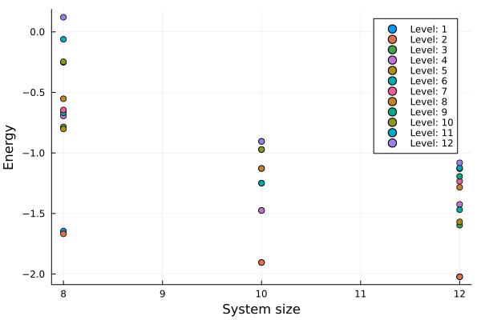

The SYK model is a statistical model where N Majorana fermions living on lattice sites interact at random.
For a q-vertex model the interaction couples q different Majorana fermions and the couplings are gaussianly distributed with zero mean and variance J^2(q-1)!/N^{q-1}. 
The Hamiltonian must still be hermitian to represent a physical system, this impose another constraint on the coefficients.

With the code q2model.jl one can simulate, using the ITensors julia library, a system of N Majorana fermions interacting via the SYK model with q = 2.
Simulating in this context means evaluating the spectrum of the system for different sizes N. One can use the file plot.jl to plot this spectrum.

  

# Future works

Besides improving the q=2 model by taking more points or studying the dependence with the system size; it would be interesting to study the model with q=4, paying attention to the hermitianity requirement.
